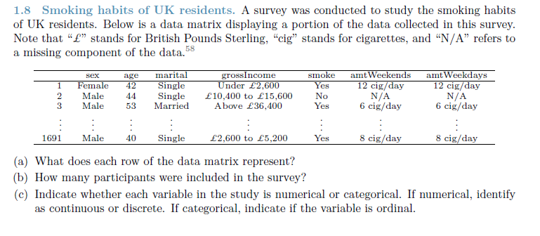
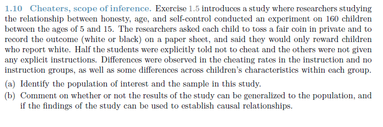
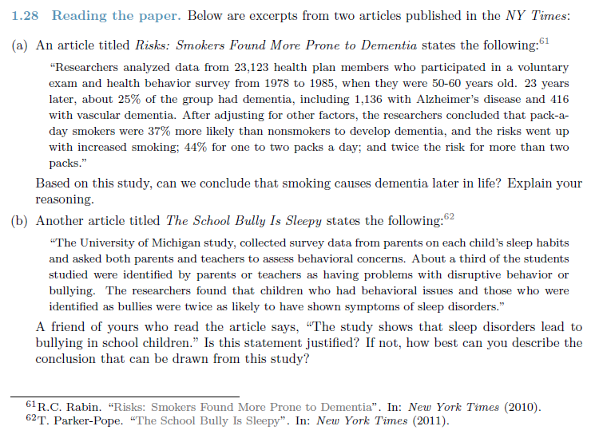
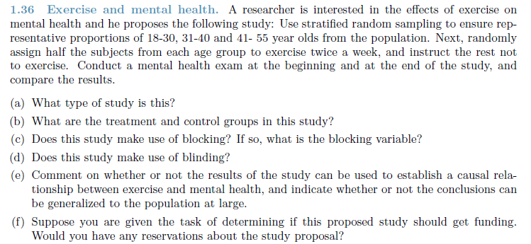
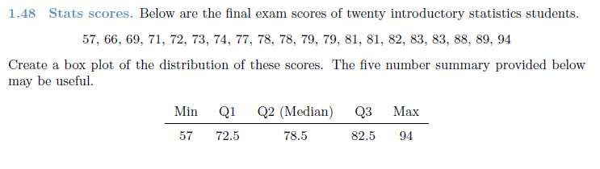
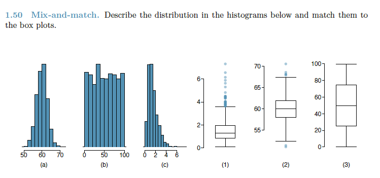
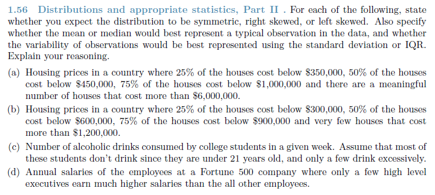
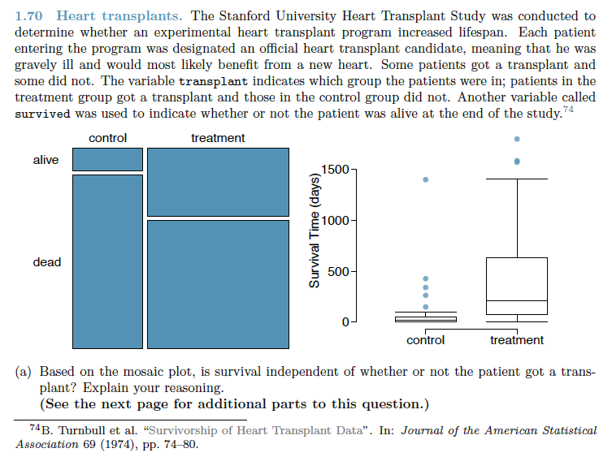
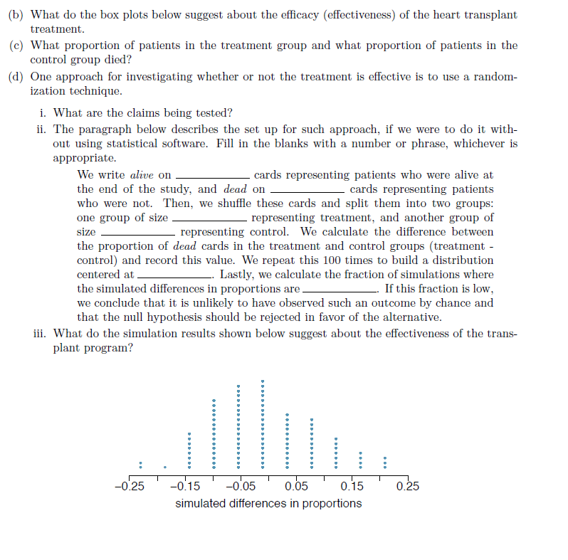

```{r setup, include=FALSE}
knitr::opts_chunk$set(echo = TRUE)
```
#Question 1


##Answer1

(a) Each row represent the response of one person that completed the survey.
(b) 1691
(c) Sex: categorical/nominal, age: numerical/continuous, marital: categorical/nominal, 
    grossIncome: categorical/ordinal, smoke: categorical/nominal, amtWeekends: numerical/discrete
    amtWeekdays: numerical/discrete
    
    
#Question 2


##Answer2

(a) The population of interest is all children.  The sample is 160 children between the ages of 5 and 15

(b) The sample seems generalisable to the population and because an experimental design was used, causal relationships can be developed.

#Question 3


##Answer3

(a)  The conclusion that smoking causes dementia cannot be made here because the research was merely an observational one.

(b)  The statement made cannot be justified.  What can be concluded is that bullies/childern with behavourial disorders are more likely to sympthoms related to sleep disorders.

#Question 4


##Answer 4

(a)  The study is an experimenal one
(b)  The treatment group is the group that was instructed to exercised, the experimental group were instructed not to exercise.
(c)  Yes, blocking was used.  The blocking variable was age group.
(d)  No blinding was not used.
(e)  Since the design is experimental, causal relationships can be determined and the data generalised to the population.
(f)  I would be concerned with how the researchers are going to ensure that the treatment/control groups follow instruction.  How will they ensure that the treatment group exercises twice per week and how will they prevent the control group from exercising.


#Question 5


##Answer5

```{r Question 1-48, eval = TRUE}
x <- c(57,66,69,71,72,73,74,77,78,78,79,79,81,81,82,83,83,88,89,94)
summary(x)
boxplot(x)
```
#Question 6


##Answer6

Description of distributions of the histograms:
*(a) the data is bell shaped around a mean of approximately 60, showing a normal distribution
*(b) the data does not have a large variation and indicates a uniform distribution
*(c) the data is positively skewed

Matching histogram to box-plot:

(a) > 2
(b) > 3
(c) > 1

#Question 7


##Answer7

(a) Distribution should be right skewed since most of the data will likely be below the mean.  The mean will be higher than 450,000 because it mentions that there are a meaninful number of houses that cost more than 6,000,000.  This will contribute to a large mean.  As a result, the median will most likely represent a typical observation of the data.

(b)  Seems like a symmetrical distribution where the mean will best represent a typical observation. This is because there are fewer high costing houses.

(c)  this will be left skewed.  A few student drinking large amounts will skew the data.  In this case the median may be a better representation of the data.

(d)  The will be symmetrical.  In this case the median will be a typical observation since the much higher salaries may increase the mean.

#Question 8



##Answer8

(a)  Survival seems dependent on the treatment since there is a noted difference between the number of persons alive when given the treatment vs whether they were part of the control group.

(b)  The treatment seem effective in saving lives (or at least prolonging it) since the mean hours of survival is higher.

(c)  

(d)  i)  That the treatment increased lifespan

ii)  We write alive on **index** cards representing patients who were alive at the end of the study, and dead on **index** cards representing patients who were not.  Then, we shuffle these cards and split them into two groups: one group of size **50** representing treatment, and another group of size **50** representing control.  We calculate the difference between the proportion of dead cards in the treatment and control groups (treatment - control) and record this value.  We repeat this 100 times to build a distribution centere at **0**.  Lastly, we calculate the fraction of simulations where the simulated differences in proportions are **positive**.  If this fraction is low, we conclude that it unlikely to have observed such an outcome by change and that the null hypothesis should be rejected in favour of the alternative.

iii)  The simulation distribution is normally distributed about the mean slightly less than 0 which would indicate that the transplant program is ineffective.

