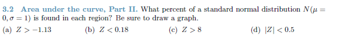
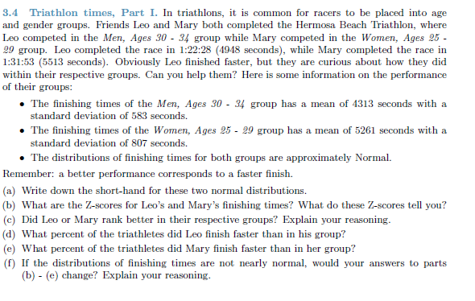
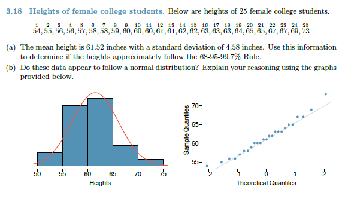
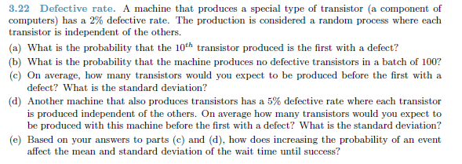
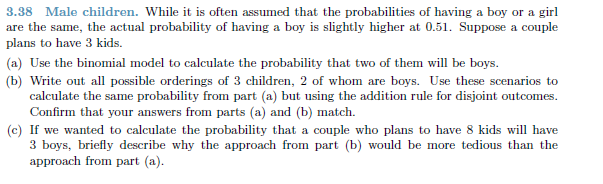
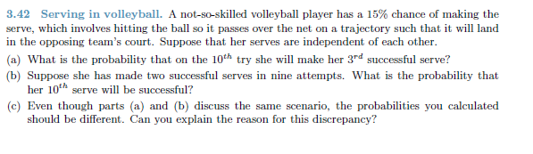

```{r setup, include=FALSE}
knitr::opts_chunk$set(echo = TRUE)
if("DATA606" %in% rownames(installed.packages()) == FALSE) {install.packages("DATA606")}
library(DATA606)
if("formattable" %in% rownames(installed.packages()) == FALSE) {install.packages("formattable")}
library(formattable)
```
#Question 1



##Answer

###(a) Z > -1.13

Graph of the distribution

```{r 1a-plot, eval = TRUE}
normalPlot(bounds = c(-1.13, Inf), tails = FALSE)
```

Probability calculation

```{r 1a,eval = TRUE}
pnorm(q = -1.13, mean = 0, sd = 1, lower.tail = FALSE)
```

###(b) Z < 0.18

Graph of the distribution

```{r 1b-plot, eval = TRUE}
normalPlot(bounds = c(-Inf,0.18), tails = FALSE)
```
Probability

```{r 1b,eval = TRUE}
pnorm(q = 0.18, mean = 0, sd = 1, lower.tail = TRUE)
```

###(c) Z > 8

Graph of the distribution

```{r 1c-plot, eval = TRUE}
normalPlot(bounds = c(8, Inf), tails = FALSE)
```

Probability calculation

```{r 1c,eval = TRUE}
pnorm(q = 8, mean = 0, sd = 1, lower.tail = FALSE)
```


###(d) |Z| < 0.5

Graph of the distribution

```{r 1d-plot, eval = TRUE}
normalPlot(bounds = c(-Inf, 0.5), tails = FALSE)
```
```{r 1d, eval = TRUE}
Part1 <- pnorm(q = 0.5 , mean = 0, sd = 1, lower.tail = TRUE)
```


Graph of the Distribution
```{r 1d-plot2, eval = TRUE}
normalPlot(bounds = c(-Inf, -0.5), tails = FALSE)
```

```{r 1d2, eval = TRUE}
Part2 <- pnorm(q = -0.5 , mean = 0, sd = 1, lower.tail = TRUE)
```


Total probability
```{r total-prob, eval = TRUE}
Part1 + Part2
```


#Question 2



##Answer

### (a)

Let M represent the finishing times of Men and W represent the finishing times of Women,

M ~ N(4313, 583)
W ~ N(5261, 807)

```{r setvariables, eval = TRUE}
meanM <- 4313
sdM <- 583

meanW <- 5261
sdW <- 807
```

### (b)

```{r z-score, eval = TRUE}
Leoz <- (4948 - meanM)/sdM
Maryz <- (5513 - meanW)/sdW

```

The z-score for Leo is: `r Leoz`
The z-score for Mary is: `r Maryz`

Both z scores indicate that the times for Mary and Leo are both above the mean with Leo's being more above the mean (one standard deviation above the mean)

### (c)

Since the larger the number of seconds, the worse the performance, Mary performed better in her group since while both were above the mean, Mary was less above the mean.
### (d)


```{r Leo-faster, eval = TRUE}
probLeo <- pnorm(q=4908, mean = meanM, sd = sdM, lower.tail = FALSE)
percent(probLeo, 2)

```

### (e)

```{r Mary-faster, eval = TRUE}
probMary <- pnorm(q=5513, mean = meanW, sd = sdW, lower.tail = FALSE)
percent(probMary,2)

```

###(f)

Even if the distributions were not nearly normal, they can be approximated to Normal with sufficient sample size so I would expect the answers to be similar.


#Question 3


##Answer

###(a)

```{r setup3a, eval = TRUE}
data3 <- c(54,55,56,56,67,58,58,59,60,60,60,61,61,62,62,63,63,63,64,65,65,67,67,69,73)

qqnorm(data3)
qqline(data3)

qqnormsim(data3)
```


###(b)  Yes the data seems to approximate the normal distribution.  The histogram is somewhat bell-shaped and the points follow the line closely.


#Question 4


##Answer

###(a)

```{r prob4a, eval = TRUE}
((1-0.02)^9)* 0.02
```

###(b)
```{r prob4b, eval = TRUE}
((1-0.02)^100)* 0.02

```
###(c)
```{r prob4c, eval = TRUE}
avg1 <- 1/0.02
sd1 <- sqrt((1-0.02)/(0.02^2))

```
Mean is `r avg1`
Sd is `r sd1`


###(d)
```{r prob4d, eval = TRUE}
avg2 <- 1/0.05
sd2 <- sqrt((1-0.05)/(0.05^2))

```
Mean is `r avg2`
Sd is `r sd2`


###(e)

Increasing the probability reduces the mean wait time until success and also reduces the sd.


#Question 5


##Answer
X ~ B(3, 0.51)

###(a)

P (X = 2)

```{r 5a, eval = TRUE}
dbinom(2, 3, 0.51)

```

###(b)

The possibilities:
BBG, BGB or GBB

```{r 5b, eval = TRUE}
BBG <- (dbinom(1,1,0.51) * dbinom(1,1,0.51) * dbinom(0,1,0.51))*3
BBG  

```

The probabilities match


### (c)

The approach from part B involves first writing out the possible combinations with 8 instead of three increasing the complexity.  Part A does not require this, the calculation can be done in one step.


#Question 6


##Answer
Negative Binomial

###(a)

10th try 3rd success p 0.15

```{r 6a, eval = TRUE}

choose(9,2)* (0.15^3) *((1-0.15)^(10-3))

```


###(b)

```{r 6b, eval = TRUE}
dbinom(1,1,0.15)

```

###(C)

Part b only asks what the probability is that the 10th serve will be successful.  It was already understood that 2 serves were made in the first nine.  Part a  asks for the probability that the 3rd sucess will be made on the tenth try without giving the assumption that the two were already made in the nine serves.
