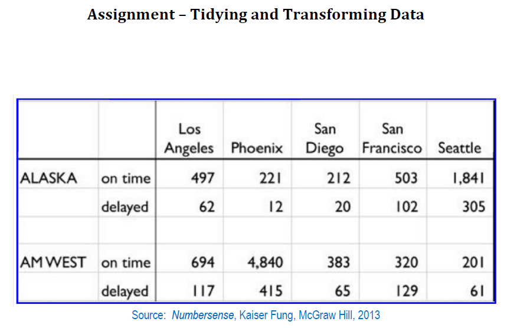
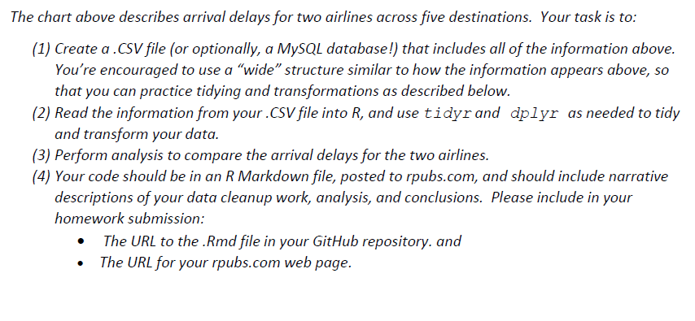

#Setup Packages

```{r setup}
knitr::opts_chunk$set(echo = TRUE)
if("tidyr" %in% rownames(installed.packages()) == FALSE) {install.packages("tidyr")}
library(tidyr)
if("dplyr" %in% rownames(installed.packages()) == FALSE) {install.packages("dplyr")}
library(dplyr)
if("stringr" %in% rownames(installed.packages()) == FALSE) {install.packages("stringr")}
library(stringr)
if("zoo" %in% rownames(installed.packages()) == FALSE) {install.packages("zoo")}
library(zoo)
if("ggplot2" %in% rownames(installed.packages()) == FALSE) {install.packages("ggplot2")}
library(ggplot2)
```


#Read in Data
```{r readData, eval= TRUE}
raw_arr_delay_data <- read.csv("arr_delay.csv", stringsAsFactors = FALSE, na.strings = c("", " "))
raw_arr_delay_data

```

#Clean Up data in Data frame

```{r cleanup, eval=TRUE}
#Remove Row 3 as it is an empty row
arr_delay_data <- raw_arr_delay_data[-c(3),]

#Cleanup Column Names
names(arr_delay_data) <- c("Airline", "Status", "Los Angeles", "Phoenix", "San Diego", "San Francisco", "Seattle")

#Remove commas from numeric data (Phoenix and Seattle Columns) so that they can be recognised as integer.  This is necessary to be able to summarise the data later on.
arr_delay_data$Phoenix <- as.integer(str_replace_all(arr_delay_data$Phoenix, ",",""))
arr_delay_data$Seattle <- as.integer(str_replace_all(arr_delay_data$Seattle, ",",""))


#Filling Missing data in Airline Column.  Will use the na.locf from the zoo package to fill the N/A values in the Airlines column
arr_delay_data <- transform(arr_delay_data, Airline = na.locf(Airline))

arr_delay_data

```

#Rearrange Data
The data is deemed to have four variables - Airline, Status(whether on time or delayed), City, Number (of flights).  Airline is in Column 1, Status in Column 2 and City and number spread among the remaining columns.  There is need to put City in its own column (the content to be the remaining column names) and the Number can be in the fourth column.  For this, the gather function (of the tidy package) will be used to reshape the data.

```{r rearrange_data, eval=TRUE}
tidy_arr_delay <- arr_delay_data %>% 
  gather(City, Number, Los.Angeles:Seattle)

tidy_arr_delay
```

#Arrival Delays

##Select delayed flights
Filter the delayed flights only.  The on time flights are not of concern for the rest of the analysis.  In addition, since the status column will be the same value, that column is no longer needed.
```{r delayed_flights, eval=TRUE}
delayed_data <- tidy_arr_delay %>% 
  filter(Status == "delayed") %>% 
  select(Airline, City, Number)
delayed_data

```

## Group delayed flights by airline
In order to summarise data by airline, the group_by function of the dplyr package will be used to group the data by airline.
```{r group_delayed, eval=TRUE}
delay_group <- group_by(delayed_data, Airline)

delay_group

```

## Total number of delayed flights by airline
Summarise by adding up the number of flights for each airline.  A bar plot is also generated from the summary data.
```{r total_delay_airline, eval=TRUE}
airline_summary <- summarise(delay_group, sum(Number))
airline_summary

barplot(airline_summary$`sum(Number)`, names.arg = airline_summary$Airline, xlab = "Airline", ylab = "Number of Delayed Flights")


```

**The graph shows that AM West had the most delayed flights**


#Delays by Airline and City
Reverting to using the non-grouped data, the data is presented in graphical format by Airline on the x-axis grouped by city.

```{r by_airline_city, eval=TRUE}

ggplot(data = delayed_data) +   
  geom_bar(
    mapping = aes(x = Airline, y = Number, fill = City), 
    stat = "identity",
    position = "dodge"
    )

```


**The graph shows that for Alaska airlines, the  most delays were in Seattle while the least were in Phoenix.  For AM West airlines the most delays were in Phoenix and the least in Seattle.**


The data is presented in graphical format by City on the x-axis grouped by Airline
                  
```{r by_city_airline, eval=TRUE}

delayed_data
ggplot(data = delayed_data) +   
  geom_bar(
    mapping = aes(x = City, y = Number, fill = Airline), 
    stat = "identity",
    position = "dodge"
    )

```


**The graph shows that AM West had the most delays in every city except Seattle where Alaska Airlines had the most delays **


